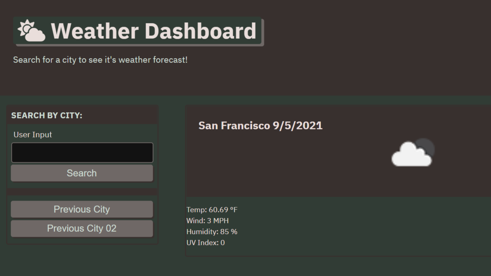

# bc-challenge-06 / Weather Dashboard

This is a simple weather dashboard application that allows a user to retrieve weather data for cities. This app runs in the browser and features dynamically updated HTML and CSS.

## User Story

```
- AS A traveler
- I WANT to see the weather outlook for multiple cities
- SO THAT I can plan a trip accordingly
```

## Acceptance Criteria

```
- GIVEN a weather dashboard with form inputs
- WHEN I search for a city
- THEN I am presented with current and future conditions for that city and that city is added to the search history
- WHEN I view current weather conditions for that city
- THEN I am presented with the city name, the date, an icon representation of weather conditions, the temperature, the humidity, the wind speed, and the UV index
- WHEN I view the UV index
- THEN I am presented with a color that indicates whether the conditions are favorable, moderate, or severe
- WHEN I view future weather conditions for that city
- THEN I am presented with a 5-day forecast that displays the date, an icon representation of weather conditions, the temperature, the wind speed, and the humidity
- WHEN I click on a city in the search history
- THEN I am again presented with current and future conditions for that city
```

The following animation demonstrates the application functionality:



### Review

-  The URL of the functional, deployed application:
-  https://joseepina.github.io/bc-challenge-06/

-  The URL of the GitHub repository:
-  https://github.com/JoseEPina/bc-challenge-06
